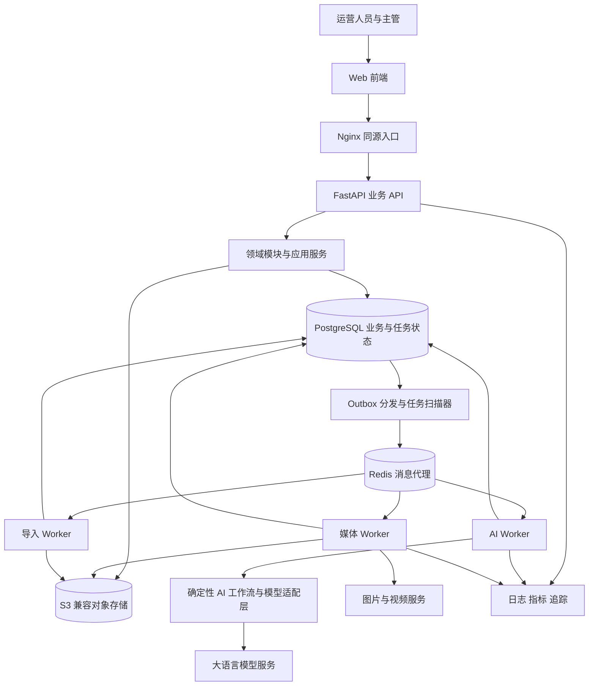
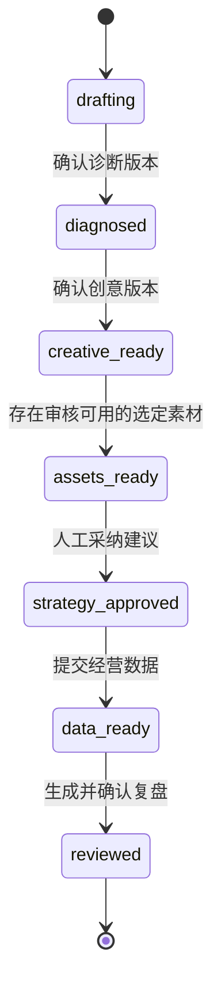
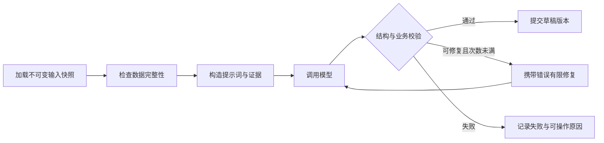
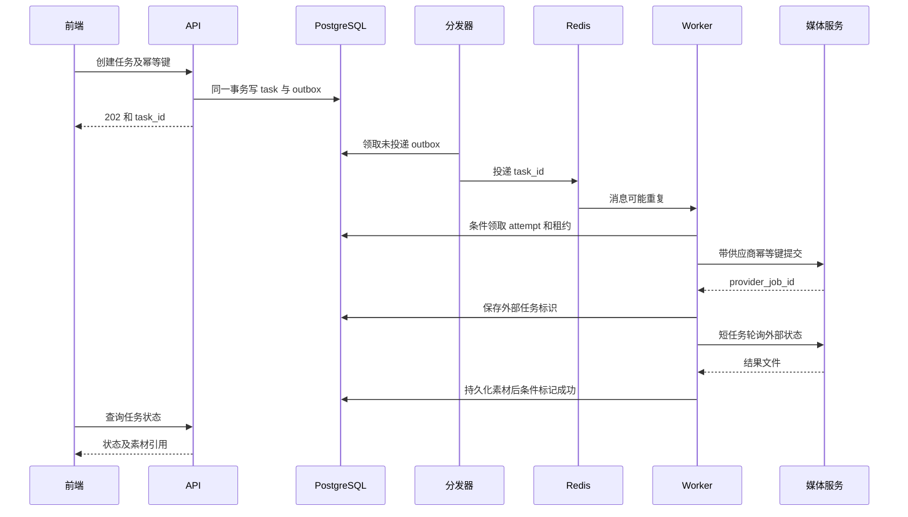
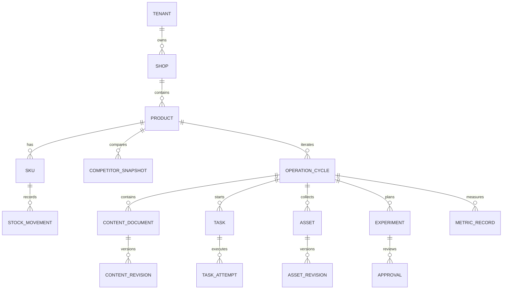

# 电商运营助手架构设计文档

版本：V2.0（准生产级作品集实现版）
日期：2026 年 9 月 12 日  
设计依据：[电商运营助手需求文档](./电商运营助手需求文档.md)，FR-01 至 FR-17、NFR-01 至 NFR-08、AC-01 至 AC-16。  
适用阶段：技术评审、详细设计、开发任务拆解、部署运维及项目验收。

## 0 准生产级实现状态

V2.0 将原先仅用于设计评审的可靠性机制落实到代码和 Compose 部署。它面向课程、求职作品集及小范围公网演示，采用单机 Docker Compose，不把“准生产级作品”夸大为多地域、高可用的企业生产集群。

| 能力 | 当前实现 |
| --- | --- |
| 数据库演进 | Alembic 为版本权威；Compose `migrate` 成功后 API、Worker 和 Dispatcher 才启动 |
| 可靠投递 | API 事务内写 generation_task、task_event、audit_log 与 outbox_event；Dispatcher 独立投递并退避重试 |
| 幂等执行 | Idempotency-Key 防止重复创建；pending 条件领取和 task_attempt 唯一约束防止重复消费 |
| 终态一致性 | 只有 active running attempt 可完成任务，迟到或重复结果不能覆盖终态 |
| AI 契约 | 诊断、创意使用 Pydantic Schema；真实模型输出允许一次有限修复，失败记录结构化错误 |
| 视频任务 | submit 和 poll 拆成短 Celery 任务，保存 provider_job_id；Dispatcher 恢复过期轮询 |
| 内容版本 | 每次生成创建不可变修订并记录 task_id，任务结果精确指向所属内容版本 |
| 可观测性 | 请求 ID、结构化 HTTP 日志、任务事件、审计日志、模型调用元数据、健康/就绪探针 |
| 部署安全 | 非 root 应用容器、no-new-privileges、日志轮转、Nginx 限流与安全头、受控媒体下载 |
| 运维 | 发布前备份，提供 prepare、migrate、backup、doctor、update、启停与日志命令 |

当前明确保留的边界：单 ECS 单实例部署；未接真实广告平台；未配置域名/TLS；媒体文件在 ECS 本地磁盘；运行中取消会阻止结果采纳，但供应商是否真正停止取决于其 API 能力。这些边界不影响作品集对工程化方法的展示，正式商用前必须继续补齐。

## 1 架构结论与设计范围

采用模块化单体后端与独立异步 Worker。前端通过 REST API 访问业务服务；PostgreSQL 保存业务事实、审批、内容版本和任务状态；Redis 作为任务消息代理；对象存储保存图片、视频和导入文件；Worker 调用大语言模型及图像、视频服务。

AI 编排采用确定性、可验证的有界任务工作流，分别执行诊断、创意、媒体生成、投放建议和复盘。当前流程较短，不为展示技术而强行引入 LangGraph；当分支、人工中断恢复或多阶段工具调用复杂度达到阈值时再引入。商品运营轮次和人工审批由业务服务管理，跨数日的投放周期不通过一个长期运行的模型会话维持。

本文同时记录已实现架构和后续演进设计。第 0 节及标记为“当前实现”的内容已进入代码；面向更大规模的机制仍属于演进建议。需求未明确的业务口径保留决策项，不把建议描述为已验证事实。

### 1.1 主要设计原则

1. 单品和运营轮次贯穿诊断、创意、素材、投放建议、指标及复盘，所有下游产物引用确定的上游版本。
2. 模型负责生成和解释；权限、数值计算、状态转换、库存变更、审批及数据写入由确定性代码控制。
3. 外部调用允许超时与重复投递，使用幂等、执行租约、状态条件更新和对账处理恢复。
4. 保留所有原文功能范围，分阶段交付代表开发顺序，不代表删除视频任务或其他需求。
5. 广告平台执行能力不进入系统：不实现广告计划创建、广告资金扣费接口或相关 AI 工具。

### 1.2 设计规模假设

先面向单个运营团队、多店铺、数十个交互用户的项目实战部署，图像和视频计算使用外部服务。该规模仅用于决定采用单体和单实例数据库，不是容量承诺。团队隔离标识进入数据模型，以便后续扩展；正式商用前通过压测、成本测算和恢复演练确定容量。

## 2 总体架构



浏览器不直接访问数据库、Redis 或携带密钥调用模型。API 与 Worker 使用同一后端代码库，通过不同启动命令运行。消息只携带任务标识，Worker 从数据库读取经过权限和版本检查的输入快照。

### 2.1 推荐技术选型

| 层次 | 推荐方案 | 选择理由及限制 |
| --- | --- | --- |
| 前端 | React、TypeScript、Vite、Ant Design | 适合工作台、管理表单、表格与素材卡片 |
| 前端数据层 | TanStack Query，少量本地状态 | 区分服务端缓存、筛选条件和编辑草稿 |
| 编辑与图表 | Tiptap、ECharts、受控 Markdown 渲染 | 支持内容编辑、指标比较，渲染时过滤危险 HTML |
| API | Python、FastAPI、Pydantic | 接口契约与模型输出校验复用类型定义 |
| 持久化 | PostgreSQL、SQLAlchemy、Alembic | 事务、约束、JSONB、版本迁移及 Outbox |
| AI 编排 | Pydantic 有类型输出与确定性任务状态机；复杂后再引入 LangGraph | 当前流程简单可测，避免不必要的框架复杂度 |
| 异步执行 | Celery、Redis | AI、媒体、导入分队列执行；业务状态以数据库为准 |
| 文件存储 | S3 兼容存储，本地可采用 MinIO | 文件与业务数据分离，使用私有桶和签名访问 |
| 表格解析 | openpyxl 与标准 CSV 解析器 | 后端执行最终字段校验；前端只做体验性预校验 |
| 部署 | Docker Compose、Nginx | 一套部署支撑完整演示，后续可独立扩容 Worker |
| 观测 | 结构化日志、OpenTelemetry、Prometheus 兼容指标 | 关联请求、任务、模型调用和外部生成任务 |

### 2.2 开发与联调环境约定

第一版后端统一使用 `uv` 管理 Python 版本、虚拟环境和依赖锁定，`backend/pyproject.toml` 与 `backend/uv.lock` 是依赖事实来源。开发命令使用 `uv run --project backend ...`；依赖发生变化后先更新并提交锁文件，再构建镜像。不得同时维护 `requirements.txt` 和另一套手工虚拟环境，避免本机与容器依赖漂移。

本机只承担源码编辑、静态检查、单元测试、Git 提交和浏览器/API 访问，不要求安装 Docker Desktop，也不在本机运行 PostgreSQL、Redis 或 Celery 容器。集成环境统一位于阿里云 ECS `/root/myproject/e_commerce_operations_copilot`，由 Docker Compose 运行 PostgreSQL、Redis、FastAPI、Celery Worker 和前端 Nginx。代码先推送 GitHub，ECS 再通过 Git 拉取并部署。

这一约定意味着“本地测试”分为两层：不依赖基础设施的后端测试可直接通过本机 `uv run` 执行；需要数据库、Redis、异步任务或完整前后端链路的集成测试在 ECS 容器中执行。PostgreSQL 和 Redis 不向公网开放，本机通过应用 API 验证业务；确需数据库诊断时通过 SSH 登录服务器后在容器内部执行命令。

具体版本应在项目初始化时验证兼容性并锁定依赖，不在设计阶段猜测最新版本。当前范围不需要向量数据库、知识库 RAG、Kubernetes 或微服务网关；若未来引入大规模商品知识检索，再独立评估。

## 3 模块边界与代码组织

| 模块 | 负责的业务 | 主要输出 | 对应需求 |
| --- | --- | --- | --- |
| identity | 登录、角色、团队及店铺访问范围 | 可信用户上下文和权限判断 | 角色权限、NFR-07 |
| catalog | 店铺、商品、SKU、平台映射、库存流水、预警 | 商品快照和库存记录 | FR-01、FR-02 |
| competitors | 竞品输入、公开数据解析、来源快照 | 竞品参数和证据引用 | FR-03 |
| operations | 运营轮次、阶段前置条件、上下游关联 | 单品闭环及下一轮入口 | FR-15、NFR-05 |
| content | 诊断、主图、脚本及所有 AI 文本的版本管理 | 可编辑和确认的内容版本 | FR-04 至 FR-07 |
| media | 媒体任务、服务适配、素材审核与归档 | 图片、视频及素材版本 | FR-08 至 FR-10 |
| experiments | 投放建议、目标值、审批、执行备注 | 经人工处理的实验计划 | FR-11、FR-12 |
| analytics | 指标记录、口径计算、对比及复盘 | 数值事实和五部分报告 | FR-13、FR-14 |
| imports | 模板、映射、校验、分批提交和错误报告 | 可追踪的导入批次 | FR-16 |
| settings | 服务配置引用、配额及超时重试规则 | 版本化配置 | FR-17 |
| runtime | 任务调度、Outbox、租约、幂等、审计 | 可恢复的执行基础能力 | NFR-02、NFR-03 |

应用服务负责事务和跨模块协作；领域模块提供业务方法；基础设施实现数据库、对象存储和外部适配器。其他模块不得绕过 catalog 直接更新库存，也不得绕过 experiments 直接写审批结果。

```text
ecommerce-operations-assistant/
  frontend/src/
    pages/                 大盘 工作台 导入 配置
    features/              商品 创意 素材 投放 复盘
    api/                   由 OpenAPI 生成的类型与客户端
  backend/app/
    api/                   路由 鉴权 错误转换
    modules/               上表各领域模块
    ai/
      graphs/              diagnosis creative strategy review
      schemas/             输入与结构化输出
      prompts/             版本化提示词
      gateway/             模型适配 配额 超时 观测
    workers/               ai media imports dispatcher watchdog
    infrastructure/        db queue storage adapters
  migrations/
  tests/                   单元 集成 故障注入 端到端
  examples/                示例商品 指标 模板
  deploy/                  Compose Nginx 配置示例
  docs/
```

## 4 三类状态及其职责

### 4.1 运营轮次状态

一个商品具有多个 operation_cycle。建议第一版限制每个商品最多一个未完成轮次，以减少指标和素材混用；使用数据库部分唯一索引实现，此限制属于待评审的设计决策。

轮次记录用于展示阶段，真正的执行前置条件由已确认版本和审批记录决定。不能只检查一个字符串状态就允许生成或审批。



图示为成功主路径。驳回投放建议保留在 assets_ready 并编辑后再审；某个生成任务失败不使整个轮次终止。生成数量必须满足主图和脚本要求，选取哪些素材用于某次实验单独记录，不将全部候选方案都生成作为阶段门槛。

复盘中的“一键下一轮”创建新轮次，携带来源报告版本和用户选定行动项，商品最新档案重新快照化。旧轮次不重置、不覆盖。重复点击通过来源报告及请求幂等键避免重复创建。

### 4.2 文本和素材状态

文本采用 draft、confirmed、archived；审批采用 draft、submitted、approved、rejected；素材采用 pending_review、usable、rejected、archived。以上为建议枚举。

已确认内容被编辑时创建新草稿版本。下游继续引用原来确认的版本，前端显示“上游存在新版本”；用户明确选择重新生成后创建新的下游产物。已批准投放内容修改后必须重新审批，历史批准内容保留。

### 4.3 执行状态

任务状态描述计算过程：pending、running、succeeded、failed、timeout。为支持原文的取消操作，建议扩展 cancelled，并增加 cancel_requested_at、external_status 字段。业务取消和供应商停止计算是两个不同结果，必须分别显示。

## 5 AI 工作流设计

### 5.1 编排边界

当前由确定性任务函数承担受控工作流：商品诊断、创意生成、媒体生成、投放建议和复盘。它不维护库存，不执行广告投放，不代替人工审批。Pydantic 完成结构校验，业务服务完成权限、状态与持久化。未来只有出现复杂分支、长暂停恢复或多工具协作时才采用 LangGraph；没有必要为每一个业务表创建 Agent，也不需要让多个 Agent 自由对话来推进明确业务流程。

统一 ModelGateway 负责服务适配、超时、并发与费用预算、提示词版本和调用记录。图节点只能经该入口调用模型。Pydantic 校验完成后，业务应用服务验证单品、轮次和上游版本，再提交内容草稿。



模型 JSON 格式修复建议最多 2 次，属于初始可配置参数；修复耗尽返回明确错误，不将缺字段或数量不足的结果标为成功。数量正确还不等于方向差异化，应检查主打卖点、构图和叙事方向的重复情况，并由运营人员最终确认。

### 5.2 工作流输入输出

| 工作流 | 输入 | 必须输出 | 校验责任 |
| --- | --- | --- | --- |
| DiagnosisGraph | 商品与 SKU 快照、竞品快照、上一轮选定建议 | 客群、价格带、卖点矩阵、转化卡点、优化方向 | 字段完整，结论可关联输入证据 |
| CreativeGraph | 已确认诊断版本、商品事实及用户约束 | 至少 3 组主图方案、3 套分镜脚本 | 数量、规定字段、差异方向、脚本开头钩子 |
| StrategyGraph | 商品定位、确认内容、可用素材、目标及预算约束 | 人群、出价建议、素材组合、A/B 实验方案 | 只引用所属轮次可用素材，无执行广告指令 |
| ReviewGraph | 冻结目标、实际指标快照、代码计算结果、批准方案与素材 | 五部分复盘内容及行动项 | 数值与计算结果一致，缺失数据明确呈现 |

### 5.3 State 与生命周期

```python
class GenerationState(TypedDict):
    task_id: str
    attempt_id: str
    tenant_id: str
    product_id: str
    cycle_id: str
    input_snapshot_id: str
    source_revision_ids: list[str]
    prompt_version: str
    schema_version: str
    provider_config_version: str
    evidence_refs: list[str]
    candidate: dict | None
    validation_errors: list[str]
    repair_count: int
    output_revision_id: str | None
```

API 从认证上下文创建 tenant_id，并验证请求中的商品和轮次；Worker 读取已保存的任务输入创建 State。load 节点填充证据，generate 写入 candidate，validate 写入错误，repair 更新计数，persist 写入 output_revision_id。State 不携带密钥、原始图片字节或完整视频。

每次执行创建独立 task_attempt，并由 task_id、attempt_no 唯一约束。Worker 只领取 pending 任务，所有终态更新同时检查 task 与 attempt 仍为 running。若未来引入 LangGraph Checkpointer，检查点只用于节点恢复，不作为审批和业务事实来源。内容通过 task_id 唯一关联，避免重复消息或迟到执行造成错误落库。

### 5.4 事实与推断

商品和竞品内容作为不可信数据输入，不能改变模型工具权限。价格、材质、防晒指数等具体事实必须来自商品或竞品快照；没有证据的性能声明标记为待补充。复盘中的归因分为“观测变化”“可能原因”“验证建议”，没有实验控制证据时不能声称已证实因果关系。

## 6 异步任务与可靠性

### 6.1 数据模型

task 保存逻辑任务和对外状态；task_attempt 保存每次实际执行；task_event 记录事件时间线。task 中含 kind、tenant_id、product_id、cycle_id、input_snapshot_id、active_attempt_id、status、version。attempt 含 attempt_no、lease_owner、lease_expires_at、heartbeat_at、deadline_at、provider_job_id、error_code、cancel_requested_at。

Celery 的任务状态仅作基础设施诊断。前端查询 PostgreSQL 中的 task，避免 Redis 丢失结果键导致业务任务消失。

### 6.2 提交与执行时序



Outbox 处理“数据库已提交但消息未发送”的问题，无法保证消息只投递一次。Worker 仍必须幂等。扫描器使用行锁与 SKIP LOCKED 领取事件；发送后标记已投递，崩溃引起的重复消息由 attempt 条件领取过滤。

### 6.3 长视频执行

媒体 Worker 将 submit、poll、collect 拆成短任务。poll 记录 next_poll_at 后释放 Worker，不通过循环 sleep 占用进程等待数分钟视频生成。扫描器投递到期任务，每次 poll 使用租约防止多进程同时处理。

外部并发配额依据仍在生成的 provider_job 计数，而非仅依据 Worker 进程数。取消请求尚未得到外部终止确认时仍占用外部配额。

### 6.4 状态转换与恢复规则

| 情况 | 状态与动作 |
| --- | --- |
| 首次领取 | pending → running，创建或领取有效 attempt |
| 结果已下载校验并保存 | running → succeeded，同时写素材元数据 |
| 明确不可重试错误 | running → failed，记录结构化原因 |
| 超过 deadline | running → timeout，禁止迟到回调覆盖终态 |
| 排队中取消 | 条件更新为 cancelled，后续重复消息直接跳过 |
| 运行中取消 | 设置取消请求并禁止成果自动采纳；适配器尝试外部取消，记录是否成功 |
| 失败或超时后重试 | 新建 attempt，逻辑任务回 pending，保留全部历史 |
| Worker 租约失效 | 先核对 provider_job；可以查到的继续查询，不能直接重新扣费提交 |

建议逻辑取消完成后使用 cancelled 对外呈现，同时 external_status 保留 still_running 或 cancellation_confirmed。迟到结果仅供对账，可进入隔离对象前缀，不自动出现在可用素材库。终态更新须匹配 active_attempt_id、version 和未取消条件，旧 attempt 无权覆盖新 attempt。

### 6.5 外部提交结果未知

如果供应商已受理但客户端未收到响应，使用稳定的 provider_idempotency_key 查询或重复幂等提交。若供应商既不支持幂等也不支持按请求查询，则标记错误码 SUBMISSION_UNKNOWN 和 reconciliation_required，暂停自动重新提交，提示人工确认。此时不能承诺“精确一次”执行或绝不重复计费。

外部生成服务可能产生费用，系统应记录预估和供应商返回的实际费用；这与需求禁止的广告资金扣费是不同边界。

### 6.6 文件与数据库一致性

生成结果先写入私有临时对象，验证 MIME、大小、哈希及文件可读性，再事务性创建素材版本并标记任务成功。文件成功但数据库提交失败时，重复 collect 根据 task_id、attempt_id 和文件哈希复用对象。定期清理过期且无数据库引用的临时文件，不直接删除仍被内容版本引用的素材。

## 7 数据模型与约束

### 7.1 核心关系



### 7.2 表与关键字段

| 表或表组 | 主要字段及作用 |
| --- | --- |
| tenant、user、membership、shop_access | 用户角色与店铺范围；查询依据认证上下文过滤 |
| shop、platform_binding | 平台、外部接入标识、脱敏授权状态；不保存平台密码或 Cookie |
| product、sku、platform_sku_mapping | 商品主数据、规格、价格、平台 SKU 映射和 version |
| stock_balance、stock_movement | 当前库存及不可变增减流水，记录来源和幂等键 |
| competitor_snapshot | 商品归属、来源、采集时间、参数 JSON、原始内容引用 |
| operation_cycle | product_id、cycle_no、stage、previous_cycle_id、source_report_revision_id |
| input_snapshot | 冻结商品、竞品、目标和来源版本，包含 schema_version 与 hash |
| content_document、content_revision | type、current_revision_id；修订正文 JSON、渲染文本、作者、上游版本、确认状态 |
| task、task_attempt、task_event | 任务与执行历史、租约、外部标识、状态变化 |
| asset、asset_revision、asset_tag | 对象键、哈希、媒体信息、生成版本、审核人、审核状态 |
| experiment、experiment_revision、approval | 策略版本、目标快照、引用素材、审批人、时间、意见 |
| metric_record、metric_revision | 单品、平台、统计范围、周期、指标原值和口径版本、导入来源 |
| import_job、import_row | 原文件、模板版本、映射、校验结果、提交状态和行错误 |
| outbox_event、audit_event | 可靠消息事件、操作者与变更摘要 |
| provider_config_version | 服务地址、模型名、配置版本及 secret_ref |

复盘报告复用 content_document，type=review，通过显式关联表保存其引用的目标、指标、诊断、创意及投放版本。历史版本不可就地修改。

### 7.3 数据约束

- 业务表使用 UUID 主键、UTC 时间和必要的 version 字段；金额使用 Decimal，保存币种，不能使用浮点存金额。
- 单品衍生表携带 tenant_id、product_id、cycle_id。为父表定义相应复合唯一键，子表使用复合外键约束归属，避免仅凭应用层过滤阻止串商品。
- content_revision 唯一键为 document_id、revision_no；operation_cycle 唯一键为 product_id、cycle_no。
- task 的幂等键按 tenant_id、operation、idempotency_key 唯一；同键不同请求摘要返回冲突。
- stock_movement 的 source_type、source_id、sku_id 形成业务幂等约束。库存调整和流水写入同一事务，对余额行加锁。
- 对 task(status,next_poll_at)、task_attempt(lease_expires_at)、outbox_event(status,next_retry_at)、metric_record(product_id,period_start) 建索引。
- 归档采用状态标记，不级联删除已审批或已被报告引用的数据。

### 7.4 编辑并发

编辑请求携带 version 或 If-Match。版本不匹配返回 409，前端展示服务端版本并允许用户重新合并；不能静默覆盖另一运营人员的修改。内容、审批和下游引用的创建在事务中再次校验版本，防止校验后被其他请求修改。

## 8 经营指标与复盘计算

指标记录必须包含单品、平台、统计周期、粒度和口径版本。同一个统计范围不允许将日明细与覆盖同周期的汇总行重复累计。建议第一版统一按日录入并按轮次汇总；已有周期汇总数据采用独立粒度保存，复盘只选择一种可兼容来源。

| 指标 | 建议计算方式 | 必要边界 |
| --- | --- | --- |
| CTR | clicks / impressions | 分母为 0 返回不可计算；有原始分子分母才可聚合重算 |
| 转化率 | orders / clicks 或平台指定口径 | 口径需确认，禁止将不同平台定义直接混合 |
| GMV | 同币种、同统计范围成交金额汇总 | 是否扣退款需确认，保存口径版本 |
| ROI | 待确认的收益与成本公式 | GMV / 广告费通常应另命名为 ROAS，不能擅自等同 ROI |
| 动销率 | 期间有销售的在售商品数 / 期间在售商品范围 | “期间在售”的集合定义需确认 |
| 目标差值 | actual - target | 百分比指标同时给出百分点差；target=0 时不算相对增幅 |

仅导入比例而无分子分母时保留原始比例，不能直接求均值冒充整体 CTR。缺失值为 null，不等于 0。复盘通过代码计算 FactBundle，包含公式版本、数据窗口、缺失标记和证据引用；LLM 接收此包并撰写解释，最终数值由模板回填或校验。

投放目标在实验提交审核前保存，审批通过后冻结。审批后更改目标产生新版本和新审批。复盘编辑可修改叙述，但修改事实指标必须通过数据修订入口，重新计算并生成新报告版本。

## 9 导入架构

导入采用上传、映射、校验预览、确认提交四阶段。前端解析只帮助用户快速定位格式问题；后端重新解析并执行权限、字段类型、枚举、重复记录及外键归属校验。

原始文件写入对象存储，import_job 固定 file_hash、template_version、mapping_version。预览 token 绑定这些信息，用户改变映射后需重新校验。确认提交时再次检查可能变化的库存或数据版本。

建议默认“正确行分批提交，错误行保留并导出原因”，每行记录是否已提交；该默认对应需求 Q-07，需业务评审。使用每批事务与行级 savepoint，单行失败不回滚已提交批次。重复提交依据 import_job_id、row_no 和内容摘要去重。库存导入应明确是绝对余额还是增量流水，不能自动猜测。

限制文件类型、大小、解压比和行数，不执行 Excel 公式或宏。错误报告导出 CSV 时处理以 =、+、-、@ 开头的文本，防止表格公式注入。解析任务独立队列，避免大文件占用交互请求进程。

## 10 API 设计

### 10.1 契约规则

API 前缀为 /api/v1。认证用户与团队从服务端会话获得，不能相信请求体中自报的角色或 tenant_id。列表使用游标分页。错误统一返回 code、message、field_errors、request_id；校验错误用 422，权限不足用 403，版本或幂等冲突用 409，额度不足用 429。

生成和导入提交返回 202、task_id、status_url。请求创建任务、审批、库存调整、导入提交和新轮次创建支持 Idempotency-Key。幂等记录和对应业务提交在同一数据库事务处理。

### 10.2 主要接口

| 方法与路径 | 作用 | 关键约束 |
| --- | --- | --- |
| POST /shops；GET /shops | 店铺创建与列表 | 店铺访问范围 |
| GET /dashboard | 大盘与趋势 | 指定窗口和指标口径 |
| POST /products；PATCH /products/{id} | 商品建档与修改 | version 并发检查 |
| POST /products/{id}/skus | 新增规格 | 商品归属和编码唯一性 |
| POST /skus/{id}/stock-adjustments | 库存调整 | 事务、流水和幂等 |
| POST /products/{id}/competitors | 竞品录入或解析 | 输入来源校验 |
| POST /products/{id}/cycles | 创建轮次 | 活跃轮次规则 |
| POST /cycles/{id}/diagnoses | 发起诊断 | 固定输入快照 |
| POST /cycles/{id}/creatives | 发起主图和脚本生成 | 引用确认诊断版本 |
| PATCH /contents/{id} | 编辑生成内容 | 新版本与乐观锁 |
| POST /contents/{id}/confirm；POST /contents/{id}/archive | 确认与归档 | 指定 revision_id |
| POST /cycles/{id}/media-tasks | 提交图片或视频任务 | 引用选定创意版本及服务配置 |
| GET /tasks/{id}；GET /tasks/{id}/events | 状态与时间线 | 单品访问权限 |
| POST /tasks/{id}/cancel；POST /tasks/{id}/retry | 取消与重试 | 终态和外部未知结果处理 |
| GET /cycles/{id}/assets | 素材库 | 分页、标签和审核过滤 |
| POST /assets/{id}/review；POST /assets/{id}/archive | 素材审核和归档 | 明确素材版本 |
| PUT /assets/{id}/tags | 素材打标 | 审计记录 |
| POST /cycles/{id}/strategies | 生成投放建议 | 可用素材与目标输入 |
| PATCH /experiments/{id}；POST /experiments/{id}/submit | 编辑与提交审核 | 版本冻结 |
| POST /experiments/{id}/decisions | 批准或驳回 | 服务端校验审核角色 |
| POST /cycles/{id}/metrics | 经营数据录入与修订 | 口径、范围及重复控制 |
| POST /cycles/{id}/reviews | 生成复盘 | 数据快照及目标版本 |
| POST /reviews/{id}/next-cycle | 下一轮诊断入口 | 报告版本与行动项 |
| GET /import-templates/{type} | 模板下载 | 模板版本 |
| POST /imports；PUT /imports/{id}/mapping | 上传与映射 | 文件摘要及版本 |
| POST /imports/{id}/validate；POST /imports/{id}/commit | 预览与提交 | 预览 token 及幂等 |
| GET /imports/{id}/errors | 错误行详情 | 分页或受控下载 |
| GET /settings；PATCH /settings | 配置读取和更新 | 管理角色，密钥仅返回脱敏状态 |

### 10.3 媒体任务示例

```json
{
  "kind": "video",
  "source_revision_id": "uuid",
  "selected_script_id": "script-1",
  "provider_config_version": "video-profile-1",
  "parameters": {"aspect_ratio": "9:16", "duration_seconds": 15}
}
```

比例和时长仅为接口示例，不代表需求规定值。实际参数由适配器能力清单验证，不支持的组合在入队前拒绝。

### 10.4 状态推送

第一版采用轮询，建议可见任务每 2—5 秒刷新、后台标签页降频，终态停止轮询；列表批量查询避免每张卡片单独请求。后续引入 SSE 时用 task_event 自增序号与 Last-Event-ID 恢复，重连后仍查询数据库快照兜底，不依赖 Redis Pub/Sub 保存历史事件。

## 11 前端架构与交互一致性

路由分为 /dashboard、/products/:productId/cycles/:cycleId、/imports、/settings。工作台由商品上下文、诊断区、创意素材区和投放复盘区组成，各区可独立加载。

Query Key 包含 tenant、product、cycle、资源类型及过滤条件；切换单品时取消旧请求并避免将迟到结果写入新单品界面。编辑草稿按内容版本存储，页面离开前提示未保存变更。

任务显示排队、生成、成功、失败、超时和取消；供应商没有准确进度时显示阶段，不能伪造百分比。审批按钮由后端返回的 capabilities 辅助展示，但 API 必须再次校验权限和状态。

Markdown 和富文本分别保留规范化正文与结构化内容，渲染时清理脚本和危险链接。图片视频通过短期签名 URL 访问，刷新签名不创建新素材版本。

## 12 外部适配器与权限设计

### 12.1 适配接口

MediaProvider 提供 capabilities、submit、query、cancel、fetch_result；LLMProvider 提供 generate_structured；CompetitorProvider 提供 parse_public_input。返回统一错误分类：限流、可重试网络错误、参数错误、权限错误、供应商拒绝及结果未知。

供应商能力清单记录是否支持幂等、取消、状态查询、允许时长与格式。业务代码依赖接口，不在节点内硬编码具体厂商 SDK。平台授权占位适配器显式显示“未真实接入”，真实与模拟任务保存 provider_mode。

### 12.2 访问控制

角色权限与团队、店铺数据范围同时校验，Worker 执行任务前也验证资源归属和任务是否已撤销。普通用户不可修改模型配置或并发额度。审批规则建议先统一由主管或管理员执行，普通投放确认是否开放给运营人员保留为业务决策，不写死在前端。

自身系统的用户密码使用专用密码哈希；这与禁止存储外部平台账号密码不同。浏览器使用 HttpOnly、Secure、SameSite 会话 Cookie 时，明确它是本系统认证会话，不能导入或保存电商平台 Cookie。写请求配合 CSRF 防护。

外部平台账户仍仅记录接入标识和脱敏状态；若真实 OAuth 接入需要保存令牌，必须先确定需求允许的凭据托管方案，不能擅自扩展存储范围。模型服务密钥通过环境注入或 Secret Manager 引用，数据库只存 secret_ref，日志不得输出密钥。

### 12.3 外部内容和文件安全

竞品 URL 与素材下载 URL 限制协议和域名，解析 DNS 后拒绝环回、内网及云元数据地址，重定向后重新校验，设置超时和大小限制。对象桶保持私有。提示词中的竞品文本不能获得任意联网、文件访问或业务写工具权限。

## 13 配置与可观测性

配置分为部署配置、业务规则配置及模型配置版本。任务创建时固定配置版本，修改管理员配额可以影响新任务调度，但不能改变正在运行任务的已承诺输入。降低并发不主动终止现有任务，停止补充调度直到低于新配额。

每次操作关联 request_id、task_id、attempt_id、cycle_id、provider_job_id。记录队列等待时间、生成耗时、结构校验失败率、重试次数、超时数量、未知提交数量、取消后外部仍运行数量和模型用量。

建议告警包括 Outbox 积压、Worker 心跳缺失、轮询停滞、数据库连接耗尽、对象存储写失败和供应商持续限流。日志默认记录输入快照标识与摘要，完整内容受访问权限和留存策略控制。

## 14 部署与恢复

### 14.1 项目实战部署

Docker Compose 启动 nginx/web、api、worker-ai、worker-media、worker-import、dispatcher-watchdog、postgres、redis 和对象存储。不同 Worker 可共享镜像。仅 Nginx 对外开放业务端口，数据库、Redis 和对象存储管理端口限制在内部网络。

本项目不采用本机 Docker Desktop。Windows 本机使用 `uv` 执行后端静态检查和不依赖基础设施的测试；完整 Worker、PostgreSQL、Redis、API 和前端容器仅在阿里云 ECS 上运行。代码推送 GitHub 后，由 ECS 的 `/root/myproject/e_commerce_operations_copilot` 仓库执行 `git pull`、Compose 构建和启动，本机再通过公网 Web/API 完成联调。这样可以避免 Celery 原生 Windows 兼容问题，也确保测试环境与最终演示环境一致。外部图片与视频生成不要求本机或 ECS 配置 GPU。

持久化卷分别保存 PostgreSQL、对象文件和 Redis 持久化数据；Redis 可丢失后由数据库中未完成任务与 Outbox 重建调度。备份必须同时覆盖数据库及被其引用的对象版本，恢复后核对对象完整性。

### 14.2 发布流程

构建锁定依赖镜像 → 备份 → 执行向后兼容数据库迁移 → 更新 API 和 Worker → 健康检查 → 单品闭环冒烟验证。旧 Worker 先停止领取新任务，等待短任务结束；无法等待的通过租约恢复。破坏性数据库迁移需独立评审，不依赖应用回滚恢复已经删除的数据。

### 14.3 扩展条件

AI、媒体和导入队列分别扩容。只有当队列等待持续超过目标、数据库出现可测瓶颈或团队需要独立发布时，再考虑读模型、专用消息中间件、数据库高可用或拆分媒体服务。第一版不因功能名称多就拆成多套微服务。

性能、恢复时间和恢复点目标尚未获得业务承诺。建议在基准环境测出 CRUD 延迟、排队时间和重启恢复时间后，再制定正式 SLO；模型生成耗时与 API 接单耗时分别统计。

## 15 验证方案与需求覆盖

| 验证主题 | 关键验证动作 | 覆盖需求或验收 |
| --- | --- | --- |
| 商品与库存 | 多规格维护，并发调整、重复请求仅生效一次，预警规则验证 | FR-01、FR-02、AC-01 |
| 竞品与诊断 | 来源可查，输出五类字段，缺数据不编造参数 | FR-03、FR-04、AC-02 |
| 创意与编辑 | 3 组主图及 3 套脚本，版本冲突、确认和归档 | FR-05、FR-06、FR-07、AC-03、AC-16 |
| 媒体执行 | 图片和视频真实适配验证，重试、取消、超时、迟到结果 | FR-08、FR-09、AC-04、AC-09 |
| 素材库 | 版本、审核、标签、归档及商品切换隔离 | FR-10、AC-05、AC-10 |
| 审批 | 越权拒绝、批准后编辑重审，不存在广告执行调用 | FR-11、FR-12、AC-06、AC-14 |
| 指标与复盘 | 目标冻结，零分母、缺失值、口径不同和汇总去重 | FR-13、FR-14、AC-07、AC-15 |
| 下一轮 | 报告版本与建议正确传入，多次点击不重复创建 | FR-15、AC-08、AC-11 |
| 导入 | 三类模板、映射变化、错误行、部分提交及重复确认 | FR-16、AC-12 |
| 配置 | 服务参数和配额更新生效，密钥不回显 | FR-17、AC-13 |

故障注入至少覆盖：数据库提交后 Redis 不可用、消息重复、Worker 外部提交后崩溃、文件保存后事务失败、超时后外部回调到达、运行中取消但供应商无法停止、重试后旧 attempt 返回。通过条件是业务归属正确、终态不被错误覆盖、状态可恢复且未知结果不被伪装为成功。

模型测试分为固定样例的结构与事实校验、人工审阅创意质量、供应商真实链路联调。Mock 模式适用于故障注入和无密钥演示，应明确标识；不能用 Mock 通过来宣称图片视频真实生成已验证。

## 16 实施顺序

| 阶段 | 交付内容 | 阶段出口 |
| --- | --- | --- |
| 1 基础业务 | 认证、商品 SKU、库存、竞品输入、轮次和迁移 | 商品归属与库存事务通过 |
| 2 AI 内容 | 模型网关、四类 Schema、诊断与创意图、版本编辑 | 主图和脚本数量与字段达标 |
| 3 媒体任务 | Outbox、队列、租约、适配器、素材管理 | 图片与视频链路及故障恢复通过 |
| 4 投放复盘 | 目标和审批、指标计算、复盘、下一轮 | 一个单品完整闭环通过 |
| 5 完整验收 | 导入中心、大盘、配置、数据样例、测试截图 | AC-01 至 AC-16 全部逐项验证 |

阶段 5 的功能可在基础模块完成后穿插开发；本表不包含工期承诺。先确定指标口径和模板字段，再编写数据库迁移及导入契约。

## 17 待评审决策与需求疑点处理

| 需求疑点 | 本设计建议 | 仍需明确 |
| --- | --- | --- |
| Q-01 多平台接入 | 统一适配器，显式区分占位与真实模式 | 平台清单、真实授权及凭据边界 |
| Q-02 审批权限 | 权限策略可配置，初始建议主管审核 | 普通方案是否允许运营确认，高风险规则 |
| Q-03 任务取消 | 新增 cancelled，外部状态单独保存 | 供应商取消能力和相关费用提示 |
| Q-04 调度参数 | 队列隔离、租约、可配置超时重试 | 各供应商具体配额和 deadline |
| Q-05 库存预警 | SKU 级阈值和库存流水 | 阈值默认值及是否允许负库存 |
| Q-06 模板字段 | 版本化模板和后端 Schema | 完整字段、必填和编码规则 |
| Q-07 导入事务 | 正确行分批提交、错误行可追踪 | 业务是否接受部分成功及覆盖策略 |
| Q-08 指标口径 | 保存原值、粒度、口径版本，代码计算 | ROI、转化率、GMV、动销率定义 |
| Q-09 竞品输入 | 手工结构化输入起步，公开来源适配器扩展 | 必须解析的来源和格式 |
| Q-10 素材限制 | 由服务能力清单校验，素材不可变版本 | 格式、时长、尺寸和保留期限 |
| Q-11 轮次回溯 | 独立 cycle 和版本引用，建议单活跃轮次 | 是否允许同单品并行运营轮次 |
| Q-12 运行指标 | 先基准压测再确定 SLO | 用户规模、成本预算和恢复目标 |

评审时先确认影响数据契约和外部服务能力的决策，其余配置参数可在开发联调阶段确定。本文中建议默认值均应进入配置或架构决策记录，避免散落在代码中。

## 18 关键架构决策摘要

| 决策 | 采用方案 | 权衡 |
| --- | --- | --- |
| ADR-01 部署形态 | 模块化单体与独立 Worker | 降低跨服务事务成本，保留计算扩容能力 |
| ADR-02 状态权威 | PostgreSQL 保存业务及任务状态 | 增加数据库状态表，换取可追踪与恢复 |
| ADR-03 AI 编排 | 四类有界工作流及统一模型入口 | 流程明确，开放式自主操作能力受限 |
| ADR-04 一致性 | Outbox、至少一次投递、幂等消费 | 接受重复消息，不承诺外部精确一次 |
| ADR-05 人工修改 | 不可变修订与下游版本绑定 | 存储量增加，但审批和复盘可复现 |
| ADR-06 多模态执行 | 外部异步任务短轮询 | 降低本地资源要求，依赖供应商能力 |
| ADR-07 指标处理 | 代码计算事实，模型解释 | 需要先定义口径，数值可验证 |
| ADR-08 广告边界 | 只保留建议和审批 | 符合需求，不连接广告计划创建或扣费能力 |

设计追踪依据为需求文档第 1—12 节；架构新增机制用于实现和保障这些需求，不代表已经实现的系统能力。
